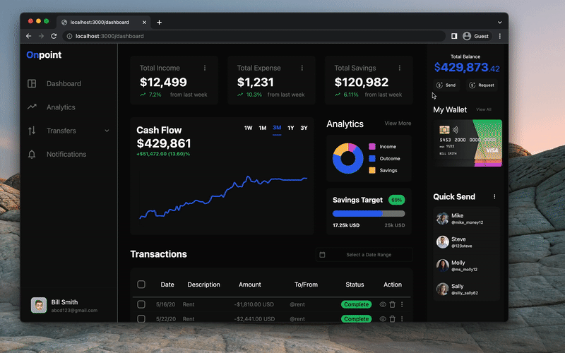

# On Point

ON Point is a full-stack, single-page stock fiance managing application built python and Next.js. Users can manage their bank accounts with easy. Mr. Hood's design was inspired by Muhammad Izza's Financial Management Dashboard.

All user data is randomly generated, chart rendering was done with the help of [ Chart.js](https://www.chartjs.org/).

## Features

- **[Cash Flow Chart](#Cash-Flow-Chart)**: An interactive chart allowing users to accurately view account history
- **[Send Money](#send-Money)**: Allows users to send/request money from a list of contacts
- **[Transaction Table](#Transaction-Table)**: Gives users the ability to managing/view transactions
- **[Quick Send](#quick-Send)**: Easily send money with the quick send feature

## Demo

### Cash Flow Chart

###### Hover to reveal chart value and percent change. Choose from five time spans Week, 30 days, 90 days, 1 year, 3 years. transaction data was randomly generated. chart design inspired by by [Robinhood's](https://www.robinhood.com/) web application.

### Quick Send

###### choose a contact and easily send entered value. Send button creates a pending transaction in the data base.

### Send Money

###### Select send or request. Search or select a contact to send receive. end button creates a pending transaction in the data base.

### Transaction Table

###### Selectable rows to easily delete tractions from database. Sort transaction by any header ascending or descending. Calendar date range selector allows user to select a start and end date for showing transactions

## Technologies

- Backend:

  - Python flask
  - Pocket Base

- Frontend:
  - React / Next
  - Chart js
  - Tailwind
